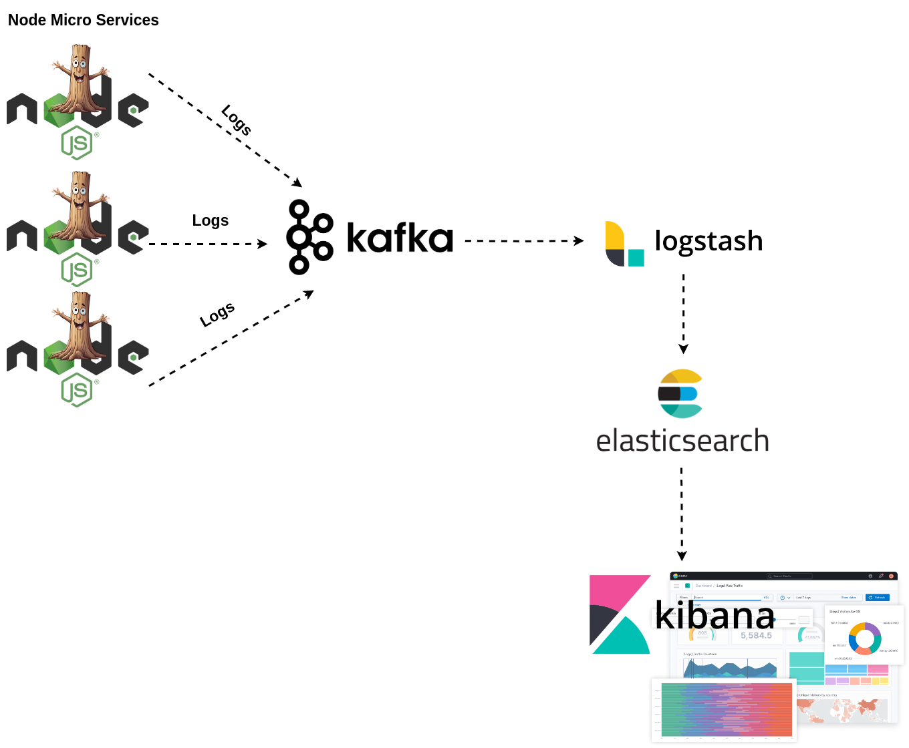

# LoggMe

LoggMe is a Fool-proof json logging utility for Node.js with colored output, file logging and Kafka broker support.


## Table of Contents

- [Installation](#installation)
- [Features](#Features)
- [Centralized Logging](#centralized-logging)
- [Usage](#usage)
  * [No Configuration](#no-configuration)
    + [Default Configurations](#default-configurations)
  * [LogLevel](#logLevel)
  * [LogFormat](#logFormat)
  * [TimeFormat](#timeFormat)
  * [FileStream](#fileStream)
# Installation

```bash
npm install loggme
```

# Features 
* Fool-proof simple configuration.
* Stdout stream, file-logging, Kafka Broker logging support.
* Easy-to-follow Centralized Log Support For Node Microservices.

# Usage
In a very basic setup, import the logging library, and call the debug method.

```js
const loggMe = require('loggMe');
loggMe.debug('Hi. You just logged this message in debug level.')
```

`Output`

```sh
DEBUG
{"level":"DEBUG","msg":"Hi. You just logged this message in debug level.","time":"2024-09-04T21:55:47.310Z"}
```


## No Configuration
When no configuration is made, the default ones are used.

### Default Configurations
 - logLevel = 'DEBUG'
 - timeFormat = 'IsoString'
 - logFormat = 'formatters.dev'
 - stream =  createConsoleStream()

```js
const loggMe = require('loggMe');

/**
 * Log only string
 * 
 * syntax;
 * loggMe.<debug|info|warn|error|fatal>(string_Message)
 */
loggMe.debug('Log this debug message.')

/**
 * Log json fields with message
 *
 * syntax;
 * loggMe.<debug|info|warn|error|fatal>({jsonObj}, string_Message)
 */
loggMe.debug({field1:"value1"},'Log this debug message.')

/**
 * Log errors
 *
 * syntax;
 * loggMe.<debug|info|warn|error|fatal>(error_Object)
 */
loggMe.debug(new Error("Something unexpected happened."))
```

To experiment all possible variations see `examples/1_no_configuration.js`.

## LogLevel
In production, only log selected logLevel and above.

`Example;`

If logLevel is set to ERROR in production, only `loggMe.error`  and `loggMe.fatal` commands work.

Debug,info and warn can still be used, but does no operation.

`Possible Log levels;`
- ['DEBUG', 'INFO', 'WARN', 'ERROR', 'FATAL']

`Operational levels after logLevel set to error;`
- ['~~DEBUG~~', '~~INFO~~', '~~WARN~~', 'ERROR', 'FATAL']

```js
const loggMe = require('loggMe');
loggMe.setLogLevel('ERROR');

loggMe.debug({field1:"value1"},'Log this debug message.')  //  no operation (DEBUG index < ERROR index)
loggMe.fatal({field1:"value1"},'Log this fatal message.')  // logged in console (FATAL index  = ERROR index)
```

To experiment all possible variations see `examples/2_set_logLevel.js`.
## LogFormat
`Possible Log Formats`
- ['dev', 'json']

By default `dev` logFormat is applied. Provides a colorful console output having a logLevel prefix.

To use File-Stream of Kafka-Stream set logFormat to json.

```js
const loggMe = require('loggMe');

loggMe.setLogFormat('json')      // Option 1
loggMe.debug('Log this debug message.')
```

To experiment all possible variations see `examples/3_setLogLevel.js`.
## TimeFormat
By default IsoString time format is applied.

`Possible Time Formats`
- ['IsoString', 'unixTimestamp']

```js
const loggMe = require('loggMe');

/**
 * set timeFormat to isoString
 */
loggMe.setTimeFormat(("IsoString"))
loggMe.debug('Log this debug message.')
// Output: {.... , "time":"2024-09-04T14:10:42.277Z"}

/**
 * set timeFormat to unixTimestamp
 */
loggMe.setTimeFormat(("unixTimestamp"))
loggMe.info('Log this info message.')
// Output: {....., "time":1725459042277}
```

To experiment all possible variations see `examples/4_set_time_format.js`.
## FileStream
Give the path of the file as an argument to createFileStream.

```js
const loggMe = require('loggMe');

/**
 * Create a json logging stream to a file. 
 * Colorful dev format does not look good on a file.
 */
loggMe.createFileStream('./logs.txt')
    .setLogFormat('json')

loggMe.info('Log this info message.')
loggMe.fatal(new Error("Something unexpected happened."))
```
To experiment all possible variations see `examples/5_create_file_stream.js`.


# Centralized Logging 

`todo` : A video tutorial will be added about this part.

